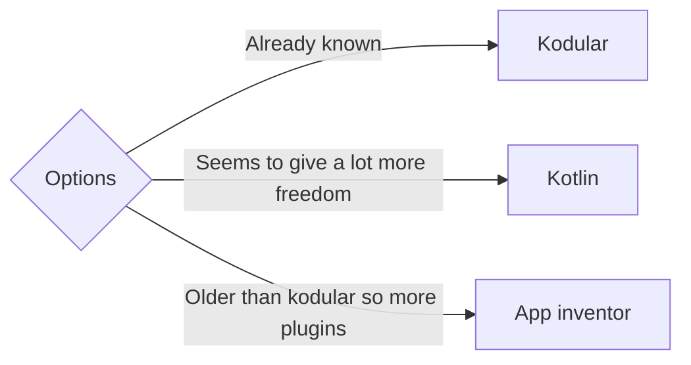

# Mathrizes

Uma calculadora descritiva para algebra linear de nivel iniciante para aparelhos android.

Decidir entre:

Tasks:

- [ ] Setup mobile

- [ ] Teorema de Laplace

- [ ] Triangulação

- [ ] Explicação em Latex
